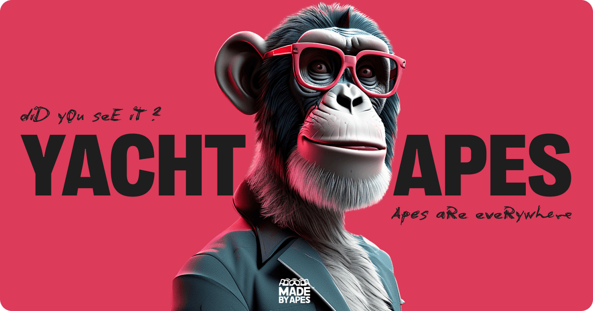

<a name="readme-top"></a>

<br />
<div align="center">
  <a href="https://github.com/Ivan011001/ape-nft">
    
  </a>

  <h3 align="center">Ape NFT</h3>

  <p align="center">
      A place to learn more about favourite Apes!
    <br />
    <a href="https://github.com/Ivan011001/ape-nft"><strong>Explore the code »</strong></a>
    <br />
    <br />
    <a href="https://ape-nft-rouge.vercel.app">View Demo</a>
    ·
    <a href="https://github.com/Ivan011001/ape-nft/issues">Report Bug</a>
    ·
    <a href="https://github.com/Ivan011001/ape-nft/issues">Request Feature</a>
  </p>
</div>

<details>
  <summary>Table of Contents</summary>
  <ol>
    <li>
      <a href="#about-the-project">About The Project</a>
      <ul>
        <li><a href="#built-with">Built With</a></li>
      </ul>
    </li>
    <li>
      <a href="#getting-started">Getting Started</a>
      <ul>
        <li><a href="#prerequisites">Prerequisites</a></li>
        <li><a href="#installation">Installation</a></li>
      </ul>
    </li>
    <li><a href="#usage">Usage</a></li>
    <li><a href="#contributing">Contributing</a></li>
    <li><a href="#contact">Contact</a></li>
  </ol>
</details>


## About The Project

https://github.com/Ivan011001/ape-nft/assets/126008836/c1016f59-2833-411f-ade2-a4ef22ceae24

**Introducing the Ape NFTs Collection Landing Page!**

Unlock the doorway to a captivating world of digital art with us. Ape NFT stand out as your all-in-one solution, simplifying your journey while making it utterly fascinating.

Why Choose Us?

* Community Connection: Join a vibrant community of art enthusiasts for discussions, collaborations, and events.
* Exclusive Benefits: Gain access to early releases, promotions, and unique experiences reserved for members.
* Swift Progress: Your dedication yields quick results. Experience art and make it an integral part of your life sooner than you think.

<p align="right">(<a href="#readme-top">back to top</a>)</p>


### Key Features

Ape NFT Webpage gives an opportunity to discover more interesting facts about Apes that everyone knows about.
Here are some examples of what users can do:

- [x] Learn more about us
- [x] Find us on other platforms
- [x] Explore Apes collection
- [x] Find answers to common questions
- [x] Mint exclusive NFT

     
### Built With


[![React][React.js]][React-url]
[![Next][Next.js]][Next-url]
[![TypeScript][TypeScript]][TypeScript-url]
[![Tailwind][Tailwind.css]][Tailwind-url]
[![Framer][Framer]][Framer-url]
[![Figma][Figma]][Figma-url]
[![EsLint][EsLint]][EsLint-url]
[![Vercel][Vercel]][Vercel-url]


<p align="right">(<a href="#readme-top">back to top</a>)</p>


## Getting Started

If you would like to enhance this project, here are instructions on setting it up locally.
To get a local copy up and running follow these simple example steps.

### Prerequisites

Make sure you have Node.js installed, check it version via
  ```sh
  node -v
  ```
It should be higher that 18.0.0

### Installation

1. Clone the repo
   ```sh
   git clone https://github.com/Ivan011001/ape-nft.git
   ```
2. Install NPM packages
   ```sh
   npm install
   ```
3. Run the app on `localhost:3000`
   ```sh
   npm run dev
   ```

<p align="right">(<a href="#readme-top">back to top</a>)</p>


## Contributing

Contributions are what make the open source community such an amazing place to learn, inspire, and create. Any contributions you make are **greatly appreciated**.

If you have a suggestion that would make this better, please fork the repo and create a pull request. You can also simply open an issue with the tag "enhancement".
Don't forget to give the project a star! Thanks again!

1. Fork the Project
2. Create your Feature Branch (`git checkout -b feature/AmazingFeature`)
3. Commit your Changes (`git commit -m 'Add some AmazingFeature'`)
4. Push to the Branch (`git push origin feature/AmazingFeature`)
5. Open a Pull Request

<p align="right">(<a href="#readme-top">back to top</a>)</p>


## Contact

Ivan Nedokhodiuk - [LinkedIn](https://www.linkedin.com/in/ivan-nedokhodiuk) - nedokhodiukivan@gmail.com

Project Link: [Ape NFT Webpage](https://ape-nft-rouge.vercel.app)

Layout Link: [Ape NFT Layout](https://www.figma.com/file/NhwvCnRetLh4PsJY3rD2d6/Ape-NFT?type=design&node-id=51%3A952&mode=design&t=FRLZSC6KhEuOSkVs-1)

<p align="right">(<a href="#readme-top">back to top</a>)</p>

[Next.js]: https://img.shields.io/badge/next.js-000000?style=for-the-badge&logo=nextdotjs&logoColor=white
[Next-url]: https://nextjs.org/
[React.js]: https://img.shields.io/badge/React-20232A?style=for-the-badge&logo=react&logoColor=61DAFB
[React-url]: https://reactjs.org/
[TypeScript]: https://img.shields.io/badge/TypeScript-007ACC?style=for-the-badge&logo=typescript&logoColor=white
[TypeScript-url]: https://www.typescriptlang.org/
[Tailwind.css]: https://img.shields.io/badge/Tailwind_CSS-38B2AC?style=for-the-badge&logo=tailwind-css&logoColor=white
[Tailwind-url]: https://tailwindcss.com/
[Vercel]: https://img.shields.io/badge/Vercel-000000?style=for-the-badge&logo=vercel&logoColor=white
[Vercel-url]: [https://img.shields.io/badge/Vercel-000000?style=for-the-badge&logo=vercel&logoColor=white](https://vercel.com/)
[Framer]: https://img.shields.io/badge/Framer-black?style=for-the-badge&logo=framer&logoColor=blue
[Framer-url]: https://www.framer.com/motion/
[Figma]: https://img.shields.io/badge/Figma-F24E1E?style=for-the-badge&logo=figma&logoColor=white
[Figma-url]: https://www.figma.com/
[EsLint]: https://img.shields.io/badge/eslint-3A33D1?style=for-the-badge&logo=eslint&logoColor=white
[EsLint-url]: https://eslint.org/
